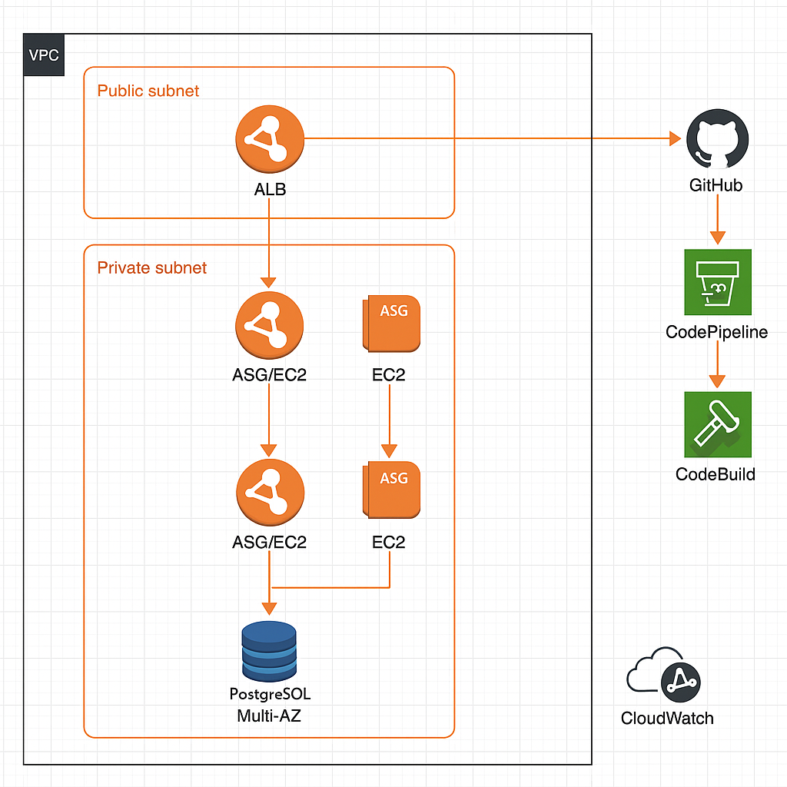

# 🗂️ 프로젝트 개요

**회의실 예약 시스템 (Meeting Reservation System)**  
사내 회의실을 시간 단위로 예약, 조회, 취소할 수 있는 백엔드 API 서버입니다.  
Spring Boot 기반 RESTful API로 개발되었으며, Docker 및 PostgreSQL을 활용하여 실행 환경을 구성했습니다.

---

## 🛠 기술 스택

| 항목            | 내용                          |
|---------------|-----------------------------|
| Language      | Java 17                     |
| Framework     | Spring Boot 3.4.5           |
| Build Tool    | Gradle - Groovy             |
| Database      | PostgreSQL 17 (Docker 기반)   |
| ORM           | Spring Data JPA             |
| Validation    | Jakarta Bean Validation     |
| Documentation | Swagger (springdoc-openapi) |
| Test          | JUnit 5                     |
| Container     | Docker, Docker Compose      |

---

## 🐳 실행 방법 (Docker Compose)

1. `application.yml`에 DB 접속 정보를 환경 변수로 관리
2. 아래 명령어로 애플리케이션과 DB를 동시에 실행:

```bash
docker-compose up --build
```

- 서버: http://localhost:8080
- DB: PostgreSQL (port: 5432)

---

## 📑 Swagger UI

API 명세 및 테스트는 Swagger UI에서 확인 가능합니다.

👉 **Swagger 접속 주소:** [http://localhost:8080/swagger-ui/index.html](http://localhost:8080/swagger-ui/index.html)

---

## 🧪 테스트 실행 방법

다음 명령어로 단위 및 통합 테스트를 실행할 수 있습니다:

```bash
./gradlew test
```

JUnit 5 기반의 테스트가 작성되어 있으며, 예약 가능 여부 및 시간 충돌 검증 로직은 테스트를 통해 보장됩니다.

---

## 📌 주요 API 예시

- 회의실 목록 조회: `GET /api/meeting-rooms`
- 예약 생성: `POST /api/reservations`

---

## ❗ 예외 처리 정책

- 잘못된 요청 (시작 > 종료 시간): `400 Bad Request`
- 예약 중복: `409 Conflict`
- 존재하지 않는 회의실/사용자 ID: `404 Not Found`

---

## ☁️ 클라우드 아키텍처 다이어그램 (AWS 기반)

클라우드 아키텍처 다이어그램은 AWS를 기반으로 설계되었으며, 다음 요소를 포함합니다:

- ALB를 통한 요청 분산 및 트래픽 관리
- EC2 + Auto Scaling Group을 이용한 앱 서버 확장성 확보
- Multi-AZ PostgreSQL DB 구성으로 가용성 보장
- CI/CD 파이프라인: GitHub → CodePipeline → CodeBuild
- CloudWatch를 통한 모니터링

다이어그램 이미지:



---

## 🔒 Deadlock(교착 상태) 방지 설계

### 💥 가능한 시나리오 예시:

- 사용자 A가 10-11시 → 11-12시로 예약 변경
- 동시에 사용자 B가 11-12시 → 10-11시로 예약 변경

→ 서로의 타임슬롯을 교차 요청하면서 데드락 발생 가능

### ✅ 해결 방법:

- **비관적 락 (PESSIMISTIC_WRITE)** 을 사용하여 동일 회의실에 대해 예약 변경 시점에 락을 걸어 교착 상태 방지
- 트랜잭션 안에서 `@Lock(LockModeType.PESSIMISTIC_WRITE)`로 선점
- 락 순서를 회의실 ID 기준으로 고정하여 교차 락 획득을 방지
- 추가로 `@Transactional`을 활용해 원자성 보장

---

## 💡 설계 시 고려한 사항

- 회의실 예약은 업무 특성상 정확성과 신속함이 중요하기 때문에, 예약 가능성 확인 시 성능보다 일관성과 정확성을 우선시함
- 동일 회의실에서만 동시성 이슈가 발생하므로, 락 범위를 좁게 유지하여 병렬성은 최대한 보장
- 예약 시간대는 30분 단위(정시, 반시)로만 허용함으로써 시간 정규화를 단순화
- 향후 요구사항 확장(회의실 분류, 반복 예약 등)에 대비하여 유연한 구조로 설계
